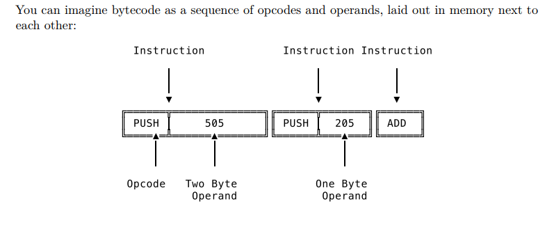
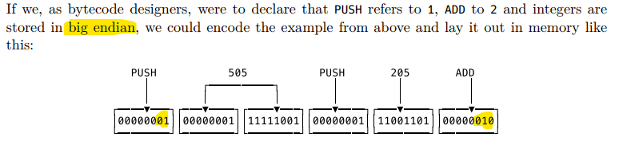

# Compiler from scratch

### Vocabulary
* immerse yourself = নিজেকে নিবিষ্ট
* intimidating
* speculations = অনুমান
* insurmountable = অনতিক্রম্য
* vague = অস্পষ্ট
* riddle =  ধাঁধা

## What we will learn?
We are going to turn our tree-walking and on-the-fly-evaluating interpreter into a bytecode compiler and a virtual machine that executes the bytecode.


#### Bytecode compilers and virtual machines are everywhere – and for good reason.

* bytecode that's passed from the compiler to the virtual machine – 
* that makes the system more modular, 
* the main appeal of this architecture lies in its performance. 
* Bytecode interpreters are fast.

> At their core, compilers and virtual machines are ideas – patterns – just like "interpreter" or "web server" are ideas that can have multiple implementations, ranging from tiny to massive. 


### special type of compiler
> a compiler that translates high-level languages to produce executables is just one special type of compiler


### producing executables is just one variation of "translating source code".

You see, compilers are fundamentally about translation, because translation is how they implement a programming language

Programming means giving instructions to a computer. We, the programmers, write these instructions in programming languages the computer can understand. There is no point in using any other language. Now, implementing a programming language means making the computer understand it. There are two ways to do that: either interpret the language for the computer on-the-fly or translate it into another language, one the computer already understands.

They both have a frontend that reads in source code written in the source language and turns it into a data structure. In both, compiler and interpreter, this frontend is usually made up of a lexer and a parser that together generate a syntax tree. So here, in the front part, they have a lot of similarities. After that, when they both traverse the AST, that’s when their paths diverge.

First, the source code is tokenized and parsed by the lexer and the parser. We’re familiar with this part from our interpreter. It’s called the frontend. The source code is turned from text into an AST.

## Von Neumann architecture

In Von Neumann's model a computer has two central parts: a processing unit, which contains an arithmetic logic unit (ALU) and multiple processor registers, and a control unit with an instruction register and a program counter. Together they’re called the central processing unit,often shortened to CPU. Besides that, the computer also contains memory (RAM), mass storage (think: hard drive) and input/output devices (keyboard and display). CPU, memory, mass storage and I/O. Here’s a rough sketch of such a computer:

Instructions only become instructions once the CPU fetches them from memory, decodes them, and finds out that they are, in fact, proper instructions and then executes them. 


We have a memory region where the CPU accesses and stores data in a LIFO manner. It does this in order to implement a specialized version of a stack, called a call stack.

Why does it need a call stack? Because the CPU (or maybe: the programmer that wants the CPU to work as intended) needs to keep track of certain information in order to execute a program.

### Return address
which instruction to fetch after the current function, is called the return address. It's where the CPU returns to after executing the current
function.

### Registers
Registers are part of the CPU and accessing them is much faster than accessing the main memory. A CPU of the x86-64 architecture, for example, has 16 general purpose registers, each holding 64 bits of data

### call stack.
It's the memory region that holds the stack.

It's a region in memory where data is managed in a last-in-first-out (LIFO) manner. The data in it grows and shrinks, you push elements on to the stack and later pop them off. Just like the stack data structure. But unlike this generic data structure, the stack is focused on one purpose: it's used to implement the call stack.

> We have a memory region where the CPU accesses and stores data in a LIFO manner. It does this in order to implement a specialized version of a stack, called a call stack.

### Why does it need a call stack? 
Because the CPU (or maybe: the programmer that wants the CPU to work as intended) needs to keep track of certain information in order to execute a program. The call stack helps with that. What information? First and foremost: which function is currently being executed and which instruction to execute next, once the current function is fully executed. This piece of information, which instruction to fetch after the current function, is called the return address. It’s where the CPU returns to after executing the current function.

Registers are used to store data that's small but frequently accessed. 

### Stack pointer
A stack pointer is a small register that stores the memory address of the last data element added to the stack or, in some cases, the first available address in the stack.

A stack register is a CPU's register whose purpose is to keep track of a call stack. 

## Virtual Machine
> a virtual machine is a computer built with software. It's a software entity that mimics how a computer works.

A virtual machine has a run loop that goes through the fetch-decode-execute cycle, just like a computer. It has a program counter; it fetches instructions; it decodes and executes them. It also has a stack, just like a real computer. Sometimes it has a call stack and sometimes even registers. All built in software.


## Virtual Machine explanation using javascript code:
It is a virtual machine that takes a program and runs it.

```js
let virtualMachine = function(program) {

  let programCounter = 0;
  let stack = [];
  let stackPointer = 0;

  while (programCounter < program.length) {

    let currentInstruction = program[programCounter];

     switch (currentInstruction) {

        case "PUSH": //Dispatching
            stack[stackPointer] = program[programCounter+1];
            stackPointer++;
            programCounter++;
            break;

        case "ADD": //Dispatching
            right = stack[stackPointer-1]
            stackPointer--;
            left = stack[stackPointer-1]
            stackPointer--;
            stack[stackPointer] = left + right;
            stackPointer++;
            break;

        case "MINUS": //Dispatching
            right = stack[stackPointer-1]
            stackPointer--;
            left = stack[stackPointer-1]
            stackPointer--;
            stack[stackPointer] = left - right;
            stackPointer++;
            break;

     }

     programCounter++;

  }

  console.log("stacktop: ", stack[stackPointer-1]);

}

let program = ["PUSH",3,"PUSH",4,"ADD","PUSH",5,"MINUS"];

```
We can build a program for it and execute it like this:

```js
let program = [ "PUSH", 3,
                "PUSH", 4,
                "ADD",
                "PUSH", 5,
                "MINUS"
              ];

virtualMachine(program);

```

> the expression encoded in above instructions? It’s this:

`(3 + 4) - 5`

### Output
```
stacktop: 2
```

## Virtual Machine Design decisions
You can write a virtual machine in around 50 lines of code, like we just did, but also in 50 thousand lines or more. And going from here to there means making all kinds of choices regarding functionality and performance.

One of the most significant design decisions is whether the machine will be `a stack machine` or `a register machine`. It's so significant that virtual machines are grouped based on this architectural choice, just like programming languages are sorted into "compiled" or "interpreted"

### What is the difference between a stack & a register ?
> The difference between a stack and a register machine is whether the machine uses a stack to do its computations or registers (virtual machine)

### Stack Machine
A stack machine and a matching compiler are said to be easier to build. The machine needs fewer parts and the instructions it executes are simpler, since they “only” make use of the stack.

*The problem is that you need to execute a lot of instructions, because you need to push and pop everything on and off the stack in order to get anything done.*

### Register Machine
Building a register machine is more work, because the registers are an addition; it still has a stack. It's not as prominent as in a stack machine, but it's still necessary to implement a call stack. 

*The advantage of a register machine is that its instructions can make use of the registers and are thus much denser compared to their stack counterparts.*

> Generally speaking, a program needs less instructions on a register machine than on a stack machine. That in turn results in better performance. But then again, writing the compiler that produces such dense instructions takes more effort. 

> Dispatching in a virtual machine means selecting an implementation for an instruction before executing it.


> Virtual machines are domain specific. That's what makes them different from their non-virtual counterparts. Computers offer us a universal
solution to all of our computational needs and are decidedly not domain specific. 

A virtual machine is like a custom-built computer. It has custom parts and a custom machine language. It’s tuned to a single programming language. All the unneeded features are stripped off and what’s left is highly specialized.

### BYTECODE
> What exactly do virtual machines execute?

Virtual machines execute bytecode. Like the machine code that computers execute, bytecode is made up of instructions that tell the machine what to do. Push this, pop that, add these, call this function. It’s called bytecode because the opcodes contained in each instruction are one
byte in size.

### OPCODE
An `opcode` is the `operator` part of an instruction, sometimes also called `op`. The `PUSH` we've seen earlier is such an opcode.

### operands
arguments or parameters. Some opcodes have multiple operands, some just one and some don’t have any at all

### mnemonics
> names, like PUSH or POP, are called mnemonics



*bytecode is a binary format and not nearly as readable. Meaning that you can't read it like a text file*

### Bytecode Order 
There are two possible orders:

1. little endian and 
2. big endian. 

> Little endian means that the least significant byte of the original data comes first and is stored in the lowest memory address. 

> Big endian is the opposite: the most significant byte comes first.



### Assemblers
> Assemblers are taking a human-readable representation of bytecode and turning it into binary data.

> `Assembly language` is the readable version of the `bytecode`, containing `mnemonics` and readable `operands`, and an assembler turns
it into binary `bytecode`. The reverse, transforming the `binary representation` into a `readable representation`, is done by `disassemblers`.

Bytecode is a domain-specific language for a domain-specific machine. It’s the bespoke machine language for the custom-built virtual machine

## Keywords need to learn
* `instruction set of a general-purpose x86-64 CPU`

## What are we going to build?
1. Virtual machine
2. Matching compiler

> Virtual machine supports a tiny number of instructions

> Matching compiler that only knows how to output these instructions.

## HELLO BYTECODE

At the end of this chapter we would be able to:

* Take the code expression `1 + 2` as input
* Tokenize and parse it using our existing [lexer](https://github.com/mateors/lexer/tree/master/lexer), [token](https://github.com/mateors/lexer/tree/master/token) and [parser packages](https://github.com/mateors/lexer/tree/master/parser)
* Take the resulting AST, whose nodes are defined in our [ast package](https://github.com/mateors/lexer/tree/master/ast)
* Pass it to the newly-built `compiler`, which compiles it to `bytecode`
* Take the `bytecode` and hand it over to the newly-built `virtual machine` which will execute it
* Make sure that the `virtual machine` produces the correct output **3**.